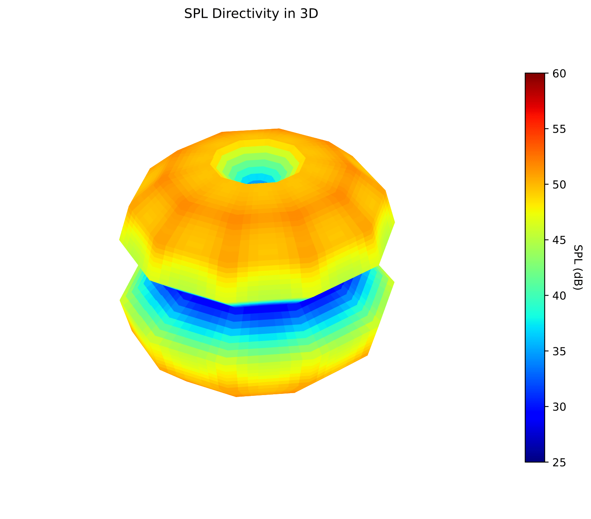

# FWH-OpenFOAM


[](http://www.openfoam.com/)
[](LICENSE)
[](https://github.com/your-username/your-repo/issues)
[](https://github.com/your-username/your-repo/stargazers)

## Description

This repository contains post-processing scripts for OpenFOAM solutions, specifically designed for FWH simulations. The implemented formulation focuses on pressure on solid surfaces, excluding convection.

[](SPL_Directivity_3Djet-1.png)
   
[](Directivity_Polar_plot_x0_0.2_freq_0.1Hz-1.png)
      

## Table of Contents

- [Installation](#installation)
- [FWH-OpenFOAM Usage](#FWH-OpenFOAMUsage)
- [Post-Processing Scripts](#Post-ProcessingScripts)
- [License](#License)

## Installation

To use the provided scripts, follow these steps:

```bash
pip install your-package
```

### FWH-OpenFOAM Usage

To utilize the post-processing scripts, sample the surface pressure during the simulation using the following function in OpenFOAM:

```bash
functions
{
  surfaceSampling
  {
    type surfaces;
    libs ("libsampling.so");
    writeControl writeTime;
    interpolationScheme cellPoint;
    setFormat ascii;
    surfaceFormat raw;
    fields (p);
    surfaces
    (
      PATCH
      {
        type patchInternalField;
        patches (PATCH);
        distance 0;
        interpolate true;
        triangulate false;
      }
    );
  }
}
```

## Post-Processing Scripts

This repository includes Python scripts for post-processing data obtained from OpenFOAM simulations. The scripts focus on tasks such as extracting and analyzing pressure data, calculating sound pressure levels (SPL), and visualizing SPL directivity in 3D.

### Script 1: read_auto.py

This script processes OpenFOAM simulation data and extracts pressure information. It performs the following tasks:

- Reads pressure data from OpenFOAM time directories.
- Initializes geometrical information and extracts pressure time signals.
- Calculates pressure on the surface and saves the results to a data file.

**Usage:**

```bash
python read_auto.py
```

Make sure to modify the script to set the appropriate patch name and adjust other parameters as needed.

### Script 2: Spectra_SPLauto.py

This script calculates the Sound Pressure Level (SPL) at a specified observer point in the simulation domain. It reads the previously processed data and performs the following tasks:

- Reads deltaT from controlDict to calculate the sampling frequency.
- Calculates SPL for a specified observer position and saves the results.
- Generates a plot of SPL over frequency.

**Usage:**

```bash
python Spectra_SPLauto.py
```

Make sure to update the observer position and adjust other parameters based on your simulation.

### Script 3: 2D_directivityauto.py

This script extends the SPL calculation to evaluate SPL directivity at multiple angles around an observer point. It performs the following tasks:

- Calculates SPL for different angles and frequencies.
- Saves directivity data to CSV files.
- Generates polar plots illustrating directivity at specific frequencies.

**Usage:**

```bash
python 2D_directivityauto.py
```

Adjust the number of angles, frequencies, and observer positions as needed.

### Script 4: 3D_directivityauto.py

This script visualizes SPL directivity in 3D. It reads the previously calculated SPL directivity data and performs the following tasks:

- Converts spherical coordinates to Cartesian coordinates.
- Interpolates data for smoother visualization.
- Generates a 3D plot of SPL directivity.

**Usage:**

```bash
python 3D_directivityauto.py
```

Customize the colormap and adjust observer positions for different visualizations.

Feel free to explore and modify these scripts based on your specific needs. If you encounter any issues or have suggestions for improvements, please create an issue in the repository.

### License

This project is licensed under the MIT License - see the [LICENSE](LICENSE) file for details.

### Acknowledgments

- This script was developed by Sparsh Sharma (DLR) and Erik Schneehagen (TU Berlin).

Feel free to customize this template according to your project's specific details. Add more sections as needed, such as installation instructions, troubleshooting tips, or any additional acknowledgments.
